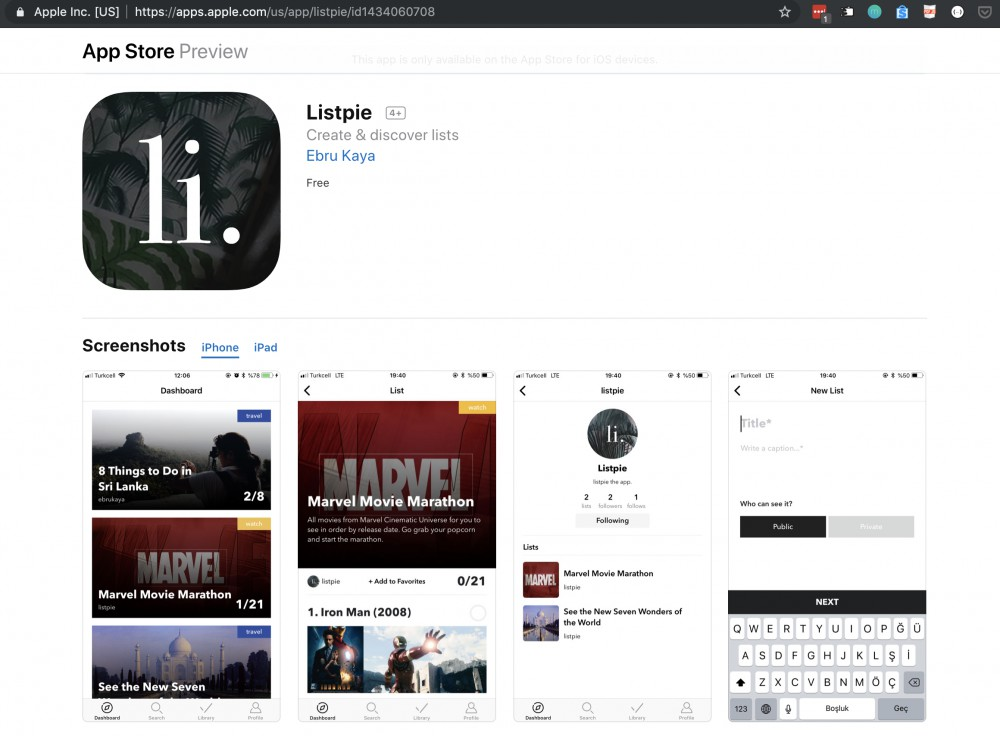

# Listpie
I decided to give mobile development a try and started to learn `Swift` for iOS development while in my gap year after graduation. This was a little side project to practice what I had learned. I realize now that I was really not aware of the best practices that much back in the time... still, I have learned a lot. 

It is not live anymore since I no longer continue to have my developer account subscription, but this was an app that allows you to create lists to complete, follow others' and track your progress.

**Technologies used;**
- Swift
- Firebase

